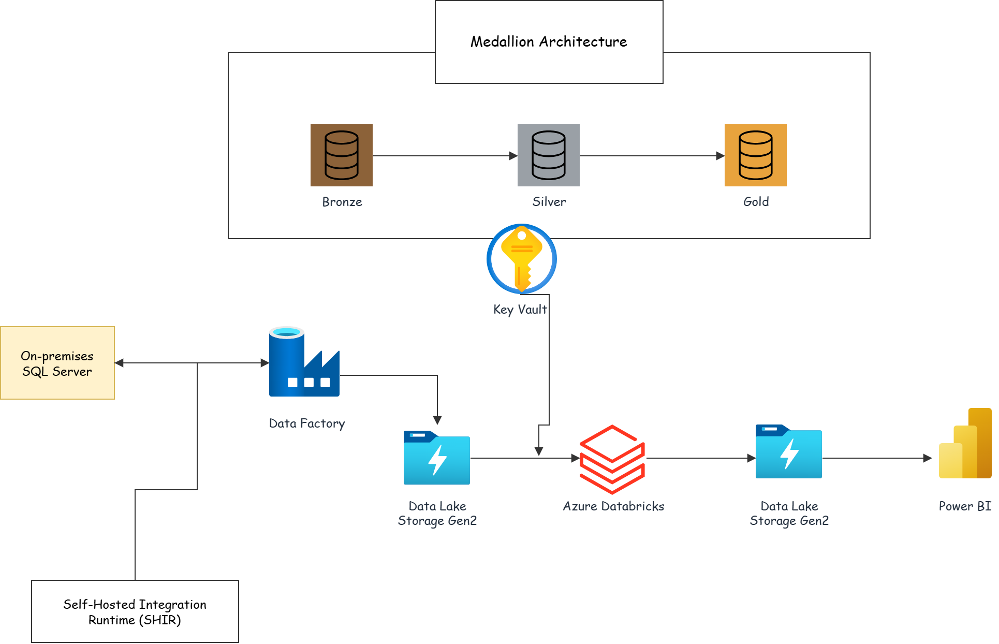
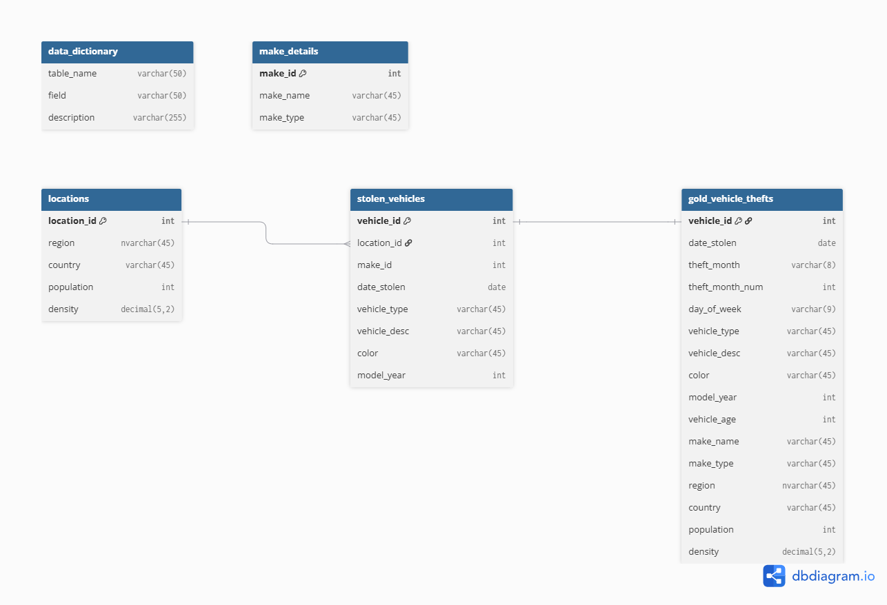
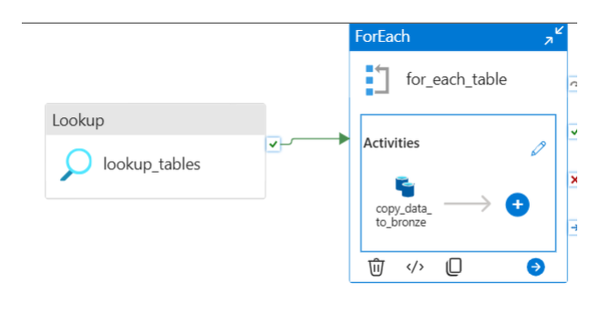
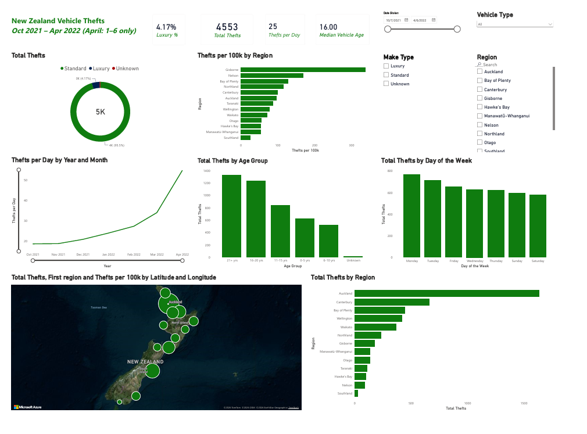

# NZ-Vehicle-Theft-Azure-Medallion-ETL

## Purpose
This pipeline moves a New Zealand stolen vehicle dataset from an on-premises SQL Server database into the Azure cloud, cleans it through a medallion architecture, and serves it to a Power BI dashboard. The source data covers 4,553 vehicle thefts recorded between October 2021 and April 2022, spread across three related tables plus a data dictionary. The end result answers where thefts concentrate, how the rate changed over the period, and what kind of vehicle is actually targeted.

## Architecture


## Data Flow
1. **Source:** Four tables in an on-premises SQL Server 2025 instance — `stolen_vehicles`, `locations`, `make_details`, and `data_dictionary`.
2. **Ingestion:** Azure Data Factory reads the on-premises database through a Self-hosted Integration Runtime and copies every table to Data Lake Storage Gen2 as CSV.
3. **Bronze Layer:** Raw CSV extracts, one folder per source table, written unchanged.
4. **Silver Layer:** Databricks casts date types, fills missing categorical values, and writes cleaned CSV per table.
5. **Gold Layer:** The three data tables are joined into a single analysis table with derived date and vehicle-age columns.
6. **Data Visualization:** Power BI Desktop reads the gold layer directly from Data Lake Storage and renders a single-page dashboard.

## Technologies Used
- **SQL Server 2025 (Developer Edition):** On-premises source database.
- **Azure Data Factory:** Orchestrates the on-premises to cloud copy.
- **Self-hosted Integration Runtime:** Bridges the local network and Azure.
- **Azure Data Lake Storage Gen2:** Medallion storage across `bronze`, `silver`, and `gold` containers.
- **Azure Databricks (PySpark):** Executes all transformation logic.
- **Azure Key Vault:** Stores the storage account key; Databricks reads it through a secret scope.
- **Power BI Desktop:** Dashboard layer, including an Azure Maps geographic visual.

## Data Model
The source is a small star-shaped schema. `stolen_vehicles` is the fact table; `locations` and `make_details` are lookups. `data_dictionary` is documentation and is carried through the layers without transformation.

| Table | Grain | Key | Rows |
| --- | --- | --- | --- |
| `stolen_vehicles` | One stolen vehicle | `vehicle_id` | 4,553 |
| `locations` | Region | `location_id` | 16 |
| `make_details` | Vehicle make | `make_id` | 138 |
| `data_dictionary` | Column definition | — | 16 |

The gold table flattens all three into one row per stolen vehicle, since a single wide table removes the need for relationship modelling in Power BI.



## ETL Pipeline

### Source Preparation

The dataset ships as a MySQL script, which will not run against SQL Server. Three incompatibilities were resolved before load:

- `CREATE SCHEMA` was replaced with `CREATE DATABASE`. In MySQL a schema is a database; in SQL Server it is a namespace inside one.
- The bulk insert of 4,553 rows was split into batches of 1,000, which is SQL Server's limit for the `VALUES` row constructor.
- A double-quoted literal (`"Hawke's Bay"`) was converted to a doubled single quote. SQL Server reads double quotes as an identifier, not a string.

The data dictionary shipped as a loose CSV that the MySQL script never loaded, so it was scripted into a fourth table to keep all reference data in the same place.

A dedicated SQL login was created for the pipeline rather than reusing Windows authentication, since the Integration Runtime executes under a service account and a Windows PIN or Microsoft account password cannot be supplied to it:

```sql
USE master;
CREATE LOGIN adf_user WITH PASSWORD = '<password>';
GO
USE stolen_vehicles_db;
CREATE USER adf_user FOR LOGIN adf_user;
ALTER ROLE db_datareader ADD MEMBER adf_user;
```

`db_datareader` is the least privilege the copy activity needs.

### Ingestion — metadata-driven copy

Rather than one Copy activity per table, the pipeline uses a Lookup and ForEach pair so that adding a table to the source database requires no pipeline change.

**Lookup** queries the system catalog for every base table:

```sql
SELECT TABLE_SCHEMA, TABLE_NAME
FROM INFORMATION_SCHEMA.TABLES
WHERE TABLE_TYPE = 'BASE TABLE'
```

`First row only` is disabled so the activity returns the full list.

**ForEach** iterates that list with `@activity('lookup_tables').output.value`. The Copy activity inside builds its source query per iteration:

```
@concat('SELECT * FROM ', item().TABLE_SCHEMA, '.', item().TABLE_NAME)
```

The sink dataset is parameterised on folder and file name, so each table lands in its own bronze folder:

```
folder_name: @item().TABLE_NAME
file_name:   @concat(item().TABLE_NAME, '.csv')
```

CSV was chosen over Parquet deliberately. Writing Parquet through a Self-hosted Integration Runtime requires a Java runtime on the on-premises host, which is an avoidable dependency for a dataset of this size.



### Storage Access — Key Vault secret scope

Databricks authenticates to the lake with the storage account key held in Key Vault, surfaced through a secret scope rather than hardcoded in a notebook:

```python
storage_account = "vehiclesa2026"
key = dbutils.secrets.get("dbScope", "vsaSecret")

spark.conf.set(f"fs.azure.account.key.{storage_account}.dfs.core.windows.net", key)

bronze = f"abfss://bronze@{storage_account}.dfs.core.windows.net"
silver = f"abfss://silver@{storage_account}.dfs.core.windows.net"
gold   = f"abfss://gold@{storage_account}.dfs.core.windows.net"
```

Direct `abfss://` access replaced the DBFS mount pattern most tutorials use. Databricks accounts created after December 2025 are provisioned without mount support, and `dbutils.fs.mount` raises `FeatureDisabledException` on them. Setting the key in the Spark configuration achieves the same result and is the currently supported approach.

### Bronze Layer

Raw reads, one DataFrame per source table:

```python
location_df    = spark.read.csv(f"{bronze}/locations/",       header=True, inferSchema=True)
make_details   = spark.read.csv(f"{bronze}/make_details/",    header=True, inferSchema=True)
stolen_veicles = spark.read.csv(f"{bronze}/stolen_vehicles/", header=True, inferSchema=True)
database_df    = spark.read.csv(f"{bronze}/data_dictionary/", header=True, inferSchema=True)
```

### Silver Layer

Profiling the source found no duplicate vehicle IDs, no untrimmed whitespace, and no orphaned make references — so the cleaning work is narrower than the typical example: a type correction and a null strategy.

**Date type.** `date_stolen` arrived as a timestamp with a meaningless `00:00:00` component, since the source records only the day:

```python
stolen_veicles = stolen_veicles.withColumn("date_stolen", F.to_date("date_stolen"))
```

**Missing values.** Three text columns carry nulls — `vehicle_type` (26 rows), `vehicle_desc` (33), and `color` (15). These rows still have a valid date and location, so dropping them would understate regional and monthly totals. They are labelled instead:

```python
stolen_vehicles_df = stolen_veicles.fillna({
    "vehicle_type": "Unknown",
    "vehicle_desc": "Unknown",
    "color": "Unknown"
})

stolen_vehicles_df.select(
    [F.sum(F.col(c).isNull().cast("int")).alias(c) for c in stolen_vehicles_df.columns]
).show()
```

`make_id` and `model_year` are left null on the 15 rows that lack them. Substituting a numeric placeholder would distort the vehicle-age distribution; the gold join labels those rows as `Unknown` instead.

All four tables are then written to silver:

```python
stolen_vehicles_df.write.mode("overwrite").option("header", True).csv(f"{silver}/stolen_vehicles")
location_df.write.mode("overwrite").option("header", True).csv(f"{silver}/locations")
make_details.write.mode("overwrite").option("header", True).csv(f"{silver}/make_details")
database_df.write.mode("overwrite").option("header", True).csv(f"{silver}/database_df")
```

### Gold Layer

The three data tables are joined and enriched with columns the dashboard needs:

```python
gold_df = (sv
    .withColumn("date_stolen", F.to_date("date_stolen"))
    .join(mk,  on="make_id",     how="left")
    .join(loc, on="location_id", how="left")
    .fillna({"make_name": "Unknown", "make_type": "Unknown"})
    .withColumn("theft_month_num", F.month("date_stolen"))
    .withColumn("theft_month",     F.date_format("date_stolen", "MMM yyyy"))
    .withColumn("day_of_week",     F.date_format("date_stolen", "EEEE"))
    .withColumn("vehicle_age",     F.year("date_stolen") - F.col("model_year"))
    .select("vehicle_id", "date_stolen", "theft_month_num", "theft_month", "day_of_week",
            "vehicle_type", "vehicle_desc", "color", "model_year", "vehicle_age",
            "make_name", "make_type",
            "region", "country", "population", "density")
)
```

Both joins are left joins. An inner join would silently drop the 15 vehicles with no make and break reconciliation against the source count, so the row count is asserted before the write:

```python
print(gold_df.count())   # must be 4553
```

The write collapses to a single file and escapes quotes in the convention Power BI expects:

```python
(gold_df
    .coalesce(1)
    .write.mode("overwrite")
    .option("header", True)
    .option("escape", '"')
    .csv(f"{gold}/vehicle_thefts"))
```

The `escape` option matters. Three vehicle descriptions contain an inch mark (`8X4-6"`). Spark's default is to escape an embedded quote with a backslash, while Power BI expects it doubled — without this option the parser treats the row as truncated and the remaining columns shift, corrupting 3 records and the rows adjacent to them.

## Dashboard

Power BI connects directly to the gold container over the `dfs` endpoint with account key authentication, combines the folder's CSV parts, and models a single flat table.

Two measures handle the reporting hazards in this dataset:

```
Days Covered = DATEDIFF(MIN(vehicle_thefts[date_stolen]), MAX(vehicle_thefts[date_stolen]), DAY) + 1
Thefts per Day = DIVIDE([Total Thefts], [Days Covered])
```

```
Thefts per 100k =
DIVIDE([Total Thefts],
       SUMX(VALUES(vehicle_thefts[region]), CALCULATE(MAX(vehicle_thefts[population])))) * 100000
```

Region latitude and longitude are supplied as explicit columns rather than relying on name geocoding, since Canterbury, Wellington, and Northland all resolve to non-New Zealand locations by default.

**Page 1 — Overview:** total thefts, thefts per day, luxury share, and median vehicle age KPIs; a daily-rate trend line; an Azure Maps bubble layer sized by volume; region rankings by both absolute count and rate per 100,000 residents; vehicle age group and day-of-week distributions; a make type breakdown. Slicers cover region, vehicle type, make type, and date range.



## Findings
- **Thefts nearly doubled over the period.** The daily rate rose from roughly 19 per day in October 2021 to 34 per day in March 2022.
- **Volume and risk point to different places.** Auckland records the most thefts at 1,638, but Gisborne has the highest rate per capita at roughly 338 per 100,000 residents — about 3.5 times Auckland's.
- **Older, ordinary vehicles are the target.** The median stolen vehicle is 16 years old and 57% are over 15 years old. Luxury makes account for 4.17% of thefts.
- **Trailers are a significant share.** Trailers, boat trailers, and caravans together make up around 18% of all recorded thefts.
- **Three regions recorded no thefts:** Tasman, Marlborough, and West Coast.

## Repository Structure
```
NZ_Vehicle_Theft_Pipeline/
├── sql/
│   ├── create_stolen_vehicles_db_sqlserver.sql   # MySQL script converted to T-SQL
│   └── add_data_dictionary_table.sql             # Loads the loose CSV as a table
├── adf/
│   └── vehicleetl_pipeline.json                  # Lookup + ForEach + Copy definition
├── databricks/
│   └── vehicle_theft_medallion.ipynb             # Bronze to silver to gold
├── powerbi/
│   └── vehicle_theft_dashboard.pbix
└── docs/
    └── images/
```

## Development Setup
To run this pipeline in your own environment:

- Install SQL Server Developer Edition and SSMS, then run the two scripts in `sql/` to build `stolen_vehicles_db`.
- Enable mixed-mode authentication, create the `adf_user` login, and enable TCP/IP in SQL Server Configuration Manager.
- Create a Data Lake Storage Gen2 account with hierarchical namespace enabled and add `bronze`, `silver`, and `gold` containers.
- Create a Data Factory, install the Self-hosted Integration Runtime on the SQL Server host, and create linked services for SQL Server and the lake.
- Import the pipeline definition and run it in Debug to populate bronze.
- Create a Key Vault, store the storage account key as a secret, and grant the AzureDatabricks service principal the Key Vault Secrets User role.
- Create a Databricks workspace with a single-node cluster in Dedicated access mode, then create a Key Vault-backed secret scope at `<workspace-url>#secrets/createScope`.
- Run the notebook top to bottom, then connect Power BI to the gold container.

## Design Notes
- **Metadata-driven ingestion over per-table activities.** One Copy activity driven by a catalog query scales to any number of source tables without pipeline edits, which is why the data dictionary table needed no pipeline change when it was added late.
- **Direct lake access over DBFS mounts.** Mounts are disabled on Databricks accounts provisioned after December 2025. Setting the account key in the Spark configuration is the supported replacement and avoids a workspace-wide mount point.
- **Label nulls, do not drop rows.** Every record with a missing make or colour still carries a valid date and region, so labelling preserves the integrity of the regional and temporal aggregates that the dashboard reports on.
- **Rate measures over raw counts.** The dataset's final month covers only six days, so a monthly count chart implies a collapse in thefts that did not happen. Every time-based visual reports a daily rate instead.
- **Explicit coordinates over geocoding.** Supplying latitude and longitude per region removes the ambiguity between New Zealand regions and identically named places elsewhere.
